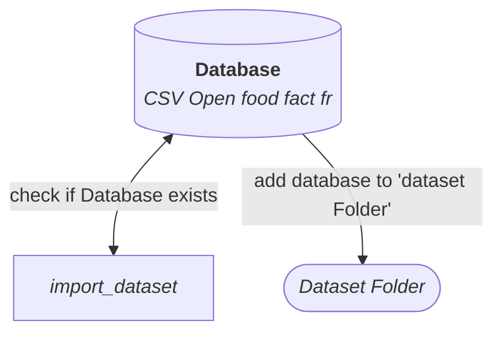

```mermaid

%%{init: {'theme':'default'}}%%
flowchart TD;
    Database[("`**Database**
    *CSV Open food fact fr* `")];
    Database <--check if Database exists--> function_import_dataset["` *import_dataset*`"];
    Database --add database to 'dataset Folder'--> folder_csv(["`*Dataset Folder*`"]);

    
    
   
```